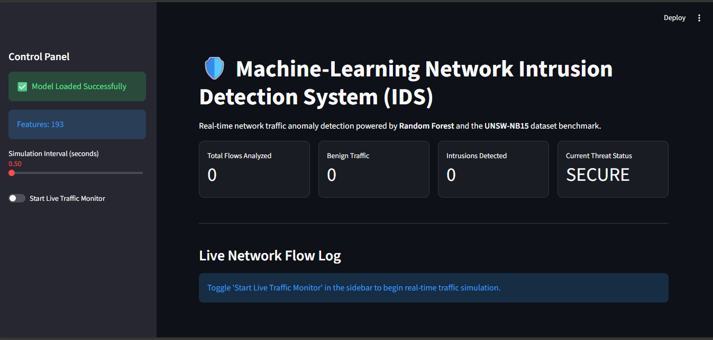

# Machine Learning Intrusion Detection System (IDS)

A machine-learning-based network intrusion detection system that classifies network-flow records as **benign** or **malicious**. The project uses the UNSW-NB15 cybersecurity benchmark dataset and a scikit-learn Random Forest classifier.

> **Project purpose:** Demonstrate practical skills in cybersecurity data preparation, supervised machine learning, model evaluation, and simulated alert generation.

## Features

- Loads the UNSW-NB15 training and testing datasets.
- Encodes categorical network features for machine learning.
- Trains a Random Forest classifier.
- Reports accuracy, precision, recall, F1-score, and a confusion matrix.
- Saves the trained model and feature metadata locally for later predictions.
- Provides a live-traffic simulation script that classifies generated network-flow records.
- Includes a Streamlit dashboard for interactive model training and intrusion analysis.

## Important Scope Note

This project demonstrates **offline dataset-based detection and simulated incoming traffic**. The current version does not capture packets directly from a network interface. Real packet capture would require an authorized environment and an additional integration with a tool such as Wireshark or a packet-capture library.

Only use packet-capture functionality on networks and devices for which you have explicit permission.

## Technology Stack

| Technology | Purpose |
|---|---|
| Python | Application and machine-learning pipeline |
| Pandas | Dataset loading and data preparation |
| NumPy | Numerical processing |
| Scikit-learn | Encoding, model training, and evaluation |
| Joblib | Local model serialization |
| Streamlit | Interactive dashboard |
| UNSW-NB15 | Network intrusion benchmark dataset |

## Project Structure

```text
intrusion_detector/
├── app.py                         # Streamlit dashboard
├── train_ids.py                   # Dataset preprocessing and model training
├── detect.py                      # Simulated real-time detection script
├── requirements.txt               # Python dependencies
├── README.md                      # Project documentation
├── .gitignore                     # Excludes datasets and generated model files
├── UNSW_NB15_training-set.csv     # Local dataset file; not uploaded to GitHub
├── UNSW_NB15_testing-set.csv      # Local dataset file; not uploaded to GitHub
└── ids_random_forest.pkl          # Generated model; not uploaded to GitHub
```

The dataset files and generated model are intentionally excluded from GitHub because they are large. A new user should download or place the dataset files in the project folder and run the training script locally.

## Installation

Open PowerShell in the project folder:

```powershell
python -m venv .venv
.\.venv\Scripts\Activate.ps1
python -m pip install --upgrade pip
pip install -r requirements.txt
```

If PowerShell blocks virtual-environment activation, run PowerShell as your normal user and use this temporary command once:

```powershell
Set-ExecutionPolicy -Scope Process -ExecutionPolicy Bypass
```

Then activate the environment again.

## Dataset Setup

Place these two files in the project root:

```text
UNSW_NB15_training-set.csv
UNSW_NB15_testing-set.csv
```

The official dataset information is available from the [UNSW-NB15 project page](https://research.unsw.edu.au/projects/unsw-nb15-dataset).

## Train the Model

After the dataset files are present, run:

```powershell
python train_ids.py
```

The script creates the local file:

```text
ids_random_forest.pkl
```

This generated model file is ignored by Git and is not included in the GitHub repository.

## Run the Simulated Detector

```powershell
python detect.py
```

The script generates network-flow examples and prints a classification such as **BENIGN** or **INTRUSION DETECTED**, together with a confidence score.

## Run the Streamlit Dashboard

```powershell
python -m streamlit run app.py
```

Streamlit will display a local address, normally:

```text
http://localhost:8501
```

Open that address in a browser. The dashboard can be used to train the model, inspect evaluation results, and test network-flow records locally.

## Model Evaluation

The current local training run produced an official test-set accuracy of approximately **87.10%**. The exact result can change when the preprocessing steps, model parameters, library versions, or dataset files change. Accuracy should be considered together with precision, recall, F1-score, and the confusion matrix rather than used alone.

## Detection Workflow

```text
UNSW-NB15 CSV files
        │
        ▼
Feature cleaning and categorical encoding
        │
        ▼
Random Forest training
        │
        ▼
Model evaluation
        │
        ▼
Local model and feature metadata
        │
        ▼
Simulated network-flow prediction
        │
        ▼
Benign result or intrusion alert
```

## GitHub File Policy

Large datasets and generated model artifacts are excluded through `.gitignore`:

```gitignore
*.pkl
*.csv
__pycache__/
.venv/
venv/
.env
```

This keeps the repository focused on source code and documentation while allowing the model to be recreated locally from the dataset.

## Screenshots

Add screenshots of the Streamlit dashboard to a local `screenshots` folder before final portfolio submission. Recommended files are:

```text
screenshots/dashboard-overview.png
screenshots/model-results.png
screenshots/detection-result.png
```

After adding them, include links such as:

```markdown



```

## Learning Outcomes

This project demonstrates experience with network-traffic feature analysis, supervised classification, cybersecurity dataset handling, model evaluation, and responsible presentation of intrusion-detection results.

## Disclaimer

This project is intended for education, authorized testing, and portfolio demonstration. It must not be used to monitor, intercept, or analyze traffic without permission from the relevant system owner.

## References

1. [UNSW-NB15 Dataset — UNSW Canberra Cyber](https://research.unsw.edu.au/projects/unsw-nb15-dataset)
2. [Scikit-learn Random Forest Classifier Documentation](https://scikit-learn.org/stable/modules/generated/sklearn.ensemble.RandomForestClassifier.html)
3. [Streamlit Documentation](https://docs.streamlit.io/)
